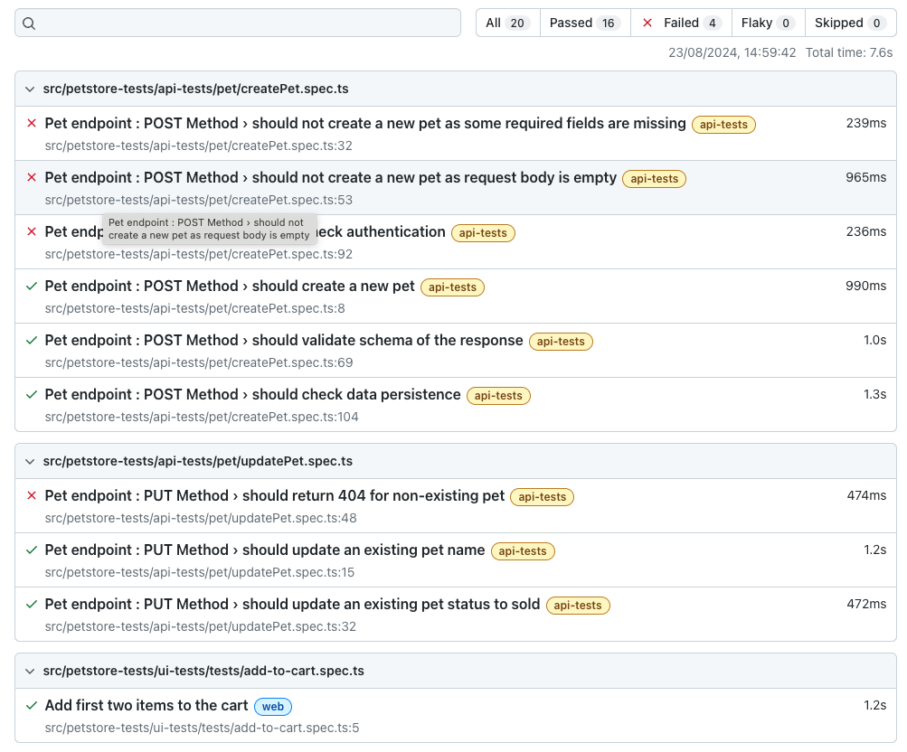

### Petcircle test


### Instructions

# Project Name 
    * Petcircle

## Prerequisites

Before you begin, ensure you have met the following requirements:

- **Git**: Ensure you have Git installed. You can download it from [git-scm.com](https://git-scm.com/).
- **Node.js and yarn**: Make sure you have Node.js and yarn installed. You can download them from [nodejs.org](https://nodejs.org/). Verify the installation by running:
  ```bash
  node -v
  npm -v
  ```


## Installation

To install the project, follow these steps:

1. **Clone the repository**:
   ```bash
   git clone https://github.com/podupu/petcircleqaassessment.git
   ```

2. **Navigate to the project directory**:
   ```bash
   cd petcircleqaassessment
   ```

3. **Install dependencies**:
   ```bash
   yarn install
   ```

4. **Playwright**: Playwright is a Node.js library to automate Chromium, Firefox, and WebKit with a single API. Install it using yarn:
  ```bash
  yarn add playwright
  ```
## Usage

To run the Playwright tests, use the following command:
```bash
npx playwright test
```

## Project Structure

Here's a brief overview of the project structure:

```
petcircleqaassessment/
├── src/
│   ├── ui-tests/
│   │   ├── pages/
│   │   └── test/
│   ├── constants/
│   │   └── selector.ts
│   ├── api-tests/
│   │   └── pet/
│   └── utils/
├── .circleci/
    ├── config.yml
├── performance/
└── postman/
├── package.json
├── tsconfig.json
└── README.md
├── DockerFile
├── playwright.config.ts
└── .gitgnore
```


## Run tests

* Run all tests:
    ```bash
    npx playwright test
    ```

* Run API tests:
    ```bash
    yarn run pw:api
    ```

* Run web tests:
    ```bash
    yarn run pw:headless:all
    ```

## CI/CD Architecture

Complete end-to-end CI/CD is accomplished using:

* [CircleCI](https://circleci.com/gh/PODHUPU/qassessment/tree/master)
* [DockerHub](https://hub.docker.com/)

### API Tests


1. When a user pushes code to GitHub, the CircleCI workflow is triggered and executes the following steps:
    * **Step 1**: Creates a Docker image of the test code and pushes it to DockerHub.
    * **Step 2**: Executes API tests inside a Docker container using the image created in Step 1, generates a Playwright test report, and stores it under Artifacts.

### Reports

**Web Chrome and API Report**

* View the web test report by opening `playwright report` located in the `playwright-report/` folder.
    
    

### Bonus: Run Performance Tests and Postman collection via Command Line


#### Pre-Requisites
* Java
* JMeter
* Newman

1. Run the performance test:
    ```bash
    jmeter -n -t <JMX FILE PATH> -l <DIR>/output.jtl
    ```

    Example:
    ```bash
    jmeter -n -t performance/performanceTest.jmx -l performanceTests/output.jtl
    ```

2. Generate the results:
    ```bash
    jmeter -g performanceTests/output.jtl -o performanceTests/html
    ```

3. Run Your Postman Collection with Newman:
    ```bash
    newman run postman/Swagger Petstore.postman_collection.json
    ```
## Contributing

To contribute to this project, follow these steps:

1. Fork the repository.
2. Create a new branch (`git checkout -b feature-branch`).
3. Make your changes and commit them (`git commit -m 'Add some feature'`).
4. Push to the branch (`git push origin feature-branch`).
5. Create a pull request.

* Node.js and yarn (latest version)
## License

This project is licensed under the MIT License - see the [LICENSE](LICENSE) file for details.